# 📱 AI-Powered Image Labeling & Analysis App (Mobile Labelling App)

This project is a comprehensive mobile image processing, labeling, and analysis application built with **React Native (Expo)** and **Moondream AI**. Users can perform AI-assisted object detection, segmentation, and detailed analysis on images captured via camera or selected from the gallery.

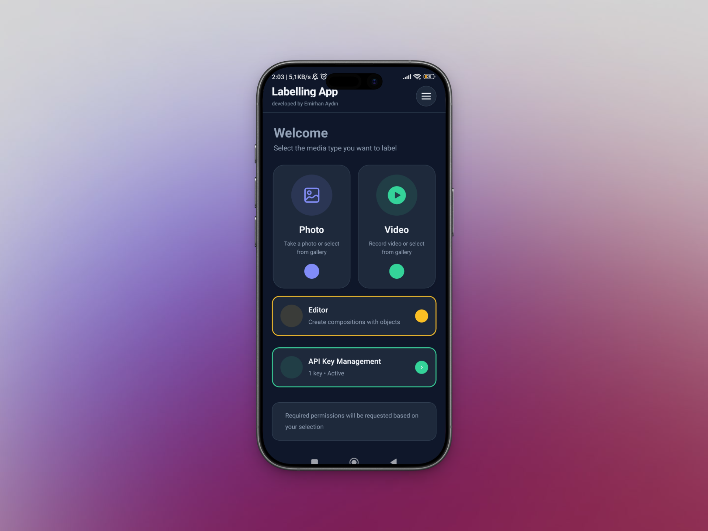

## 🚀 Quick Start (Download App)

Want to try the app immediately without building it? You can download the latest Android build directly from the link below:

👉 **[Download Android App Bundle (.aab)](https://expo.dev/artifacts/eas/boRBJy4m6TmgyMASrDNubC.aab)**

> *Note: This is an `.aab` file intended for distribution. To install it on a device, you may need to use bundletool or deploy it via the Google Play Console internal track.*

## 🌟 Features

The application includes all the features expected from a modern mobile labeling tool:

* **Multiple Input Methods:** Instant photo capture via Camera or image selection from Gallery.
* **AI-Powered Analysis (Moondream):** Analyzes images using an advanced vision model.
* **Various Labeling Modes:**
    * 📦 **Bounding Box:** Detect objects by enclosing them in boxes.
    * 📍 **Point Marker:** Focus on specific points.
    * 🎨 **Segmentation:** Pixel-based separation of object boundaries.
* **Secure API Management:** User-based API key storage and management.
* **Dark/Light Mode:** User-friendly interface responsive to device themes.

## 📸 App Preview

Here are screenshots demonstrating the application flow:

| Entry & Interface | Camera & Gallery Selection |
| :---: | :---: |
| 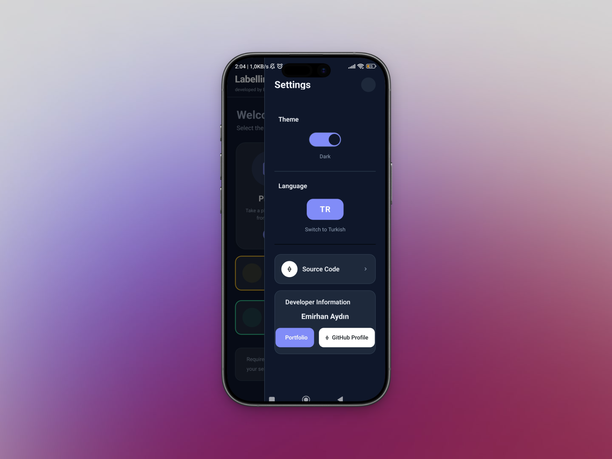 | 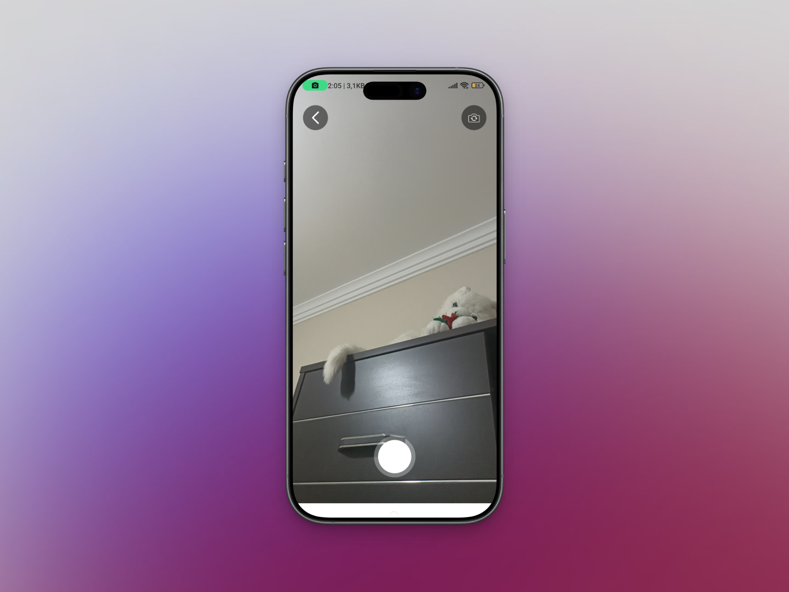 |
| *Modern & Clean UI* | *Camera Integration* |

| Analysis & Detection | Results & Settings |
| :---: | :---: |
| 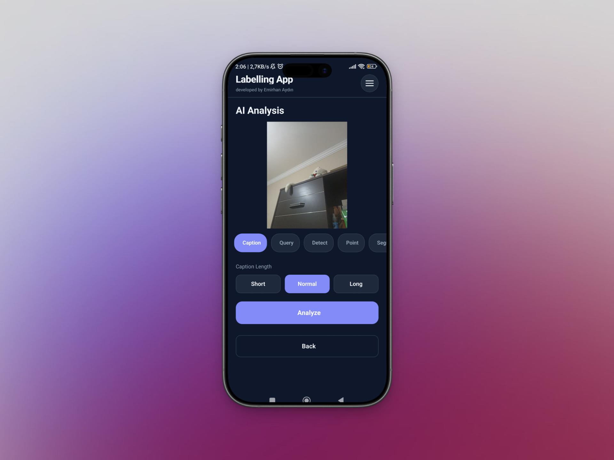 | 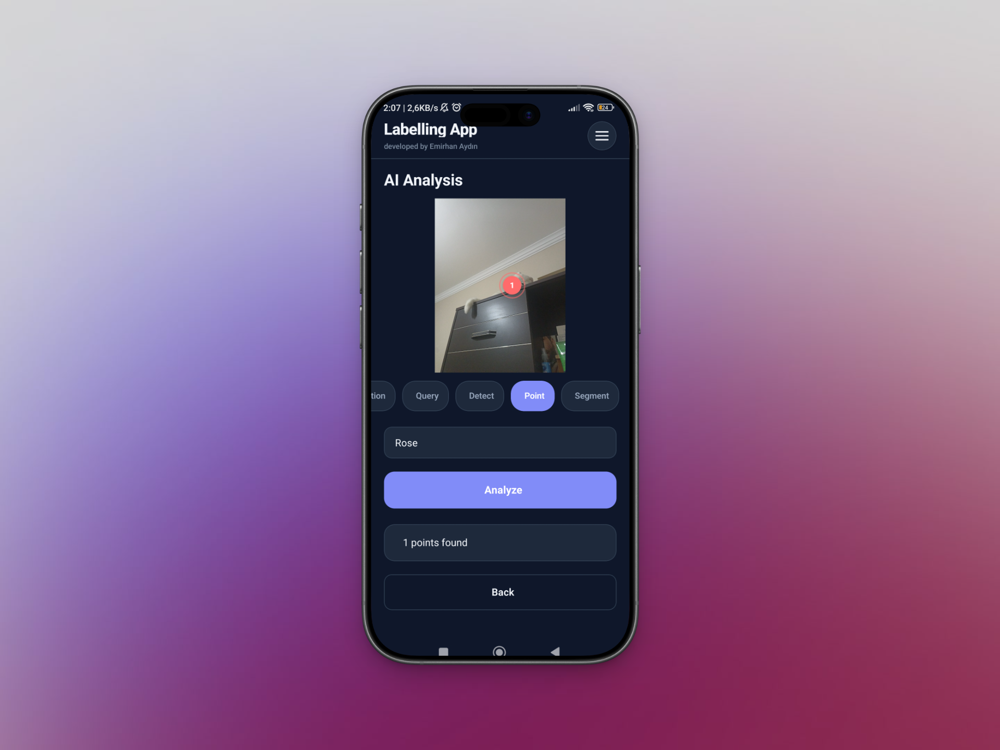 |
| 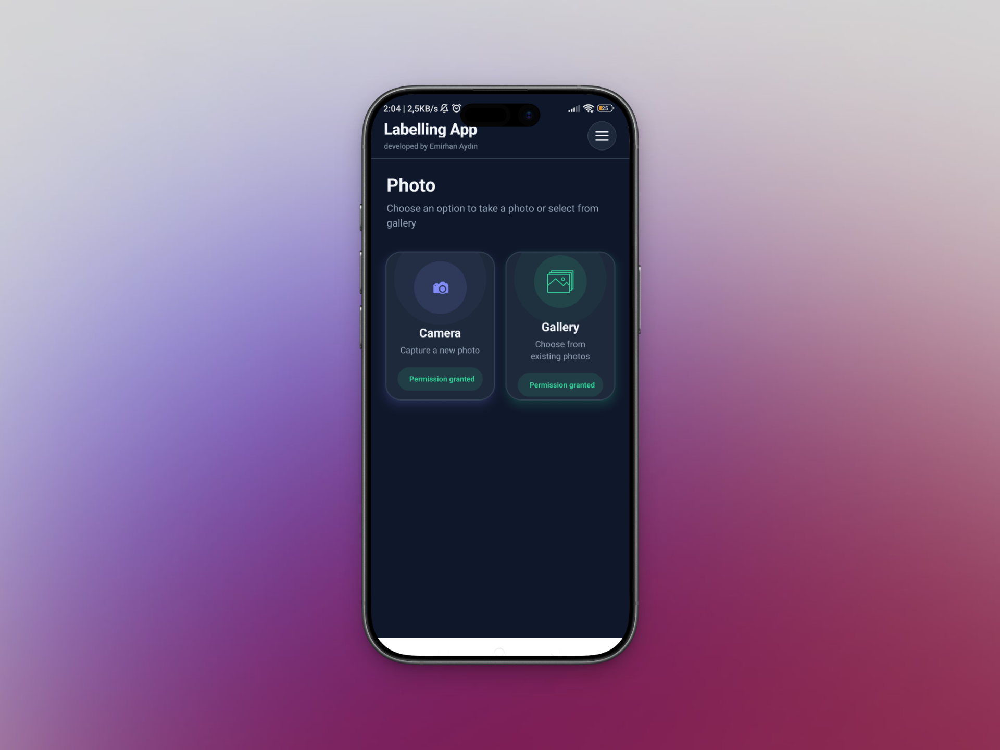 | 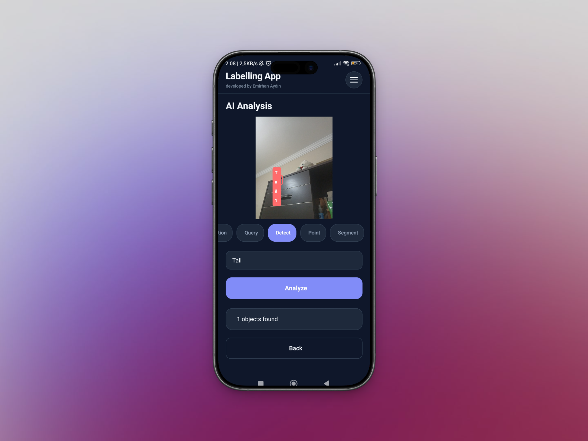 |
| 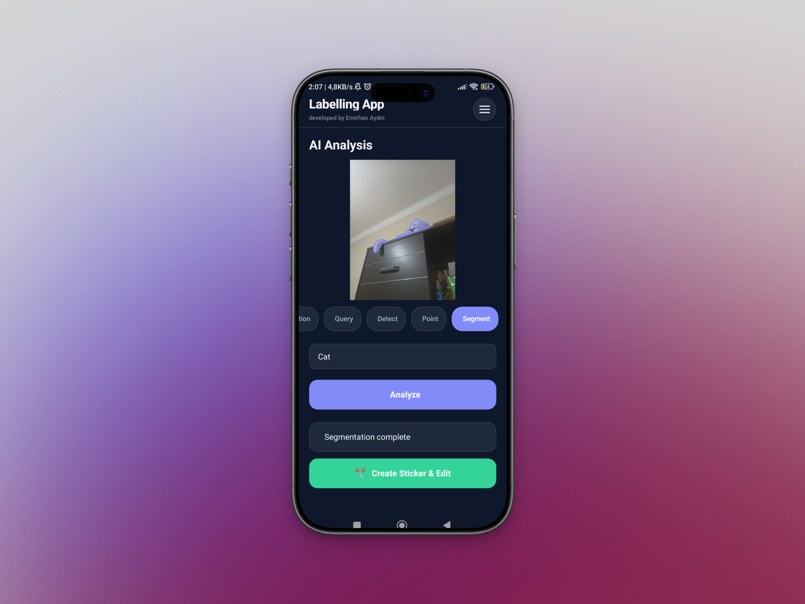 | 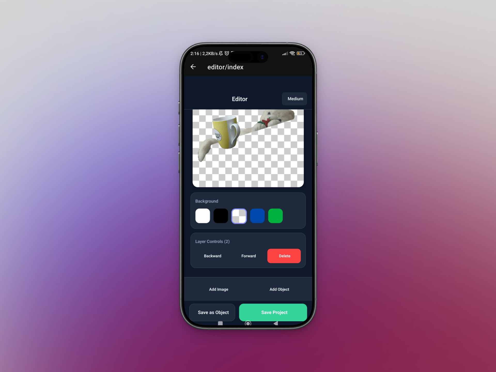 |
| 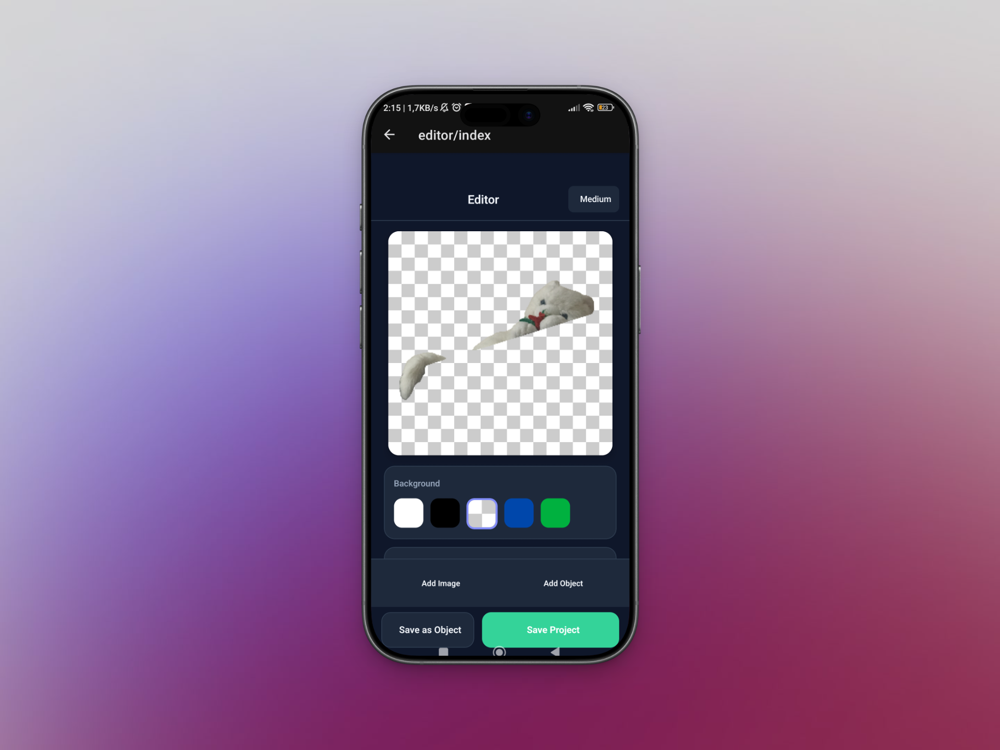 | 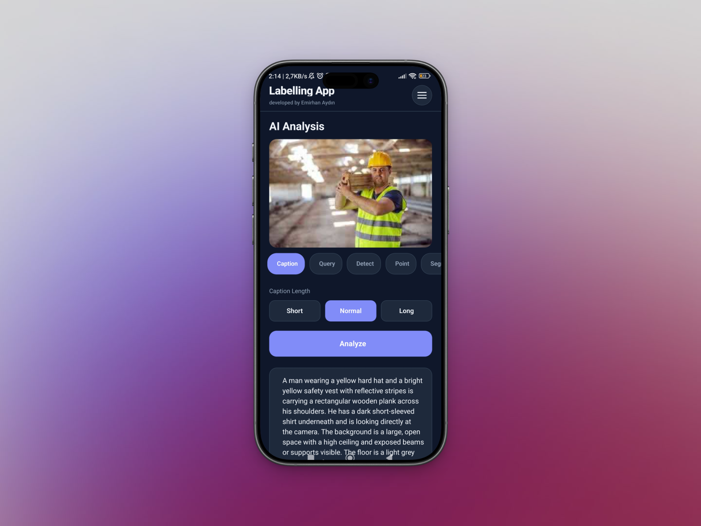 |

## 🛠 Technical Infrastructure

The project is built with the latest technologies for performance and developer experience:

* **Framework:** React Native (Expo SDK 52)
* **Language:** TypeScript
* **Navigation:** Expo Router (File-based routing)
* **AI Service:** Moondream API (For image understanding and processing)
* **State Management:** React Context API (`ApiKeyContext`, `ThemeContext`)
* **UI Components:** Custom Themed View/Text and Overlay components.

## 🚀 Installation & Setup

Follow these steps to run the project on your local machine and install it on your phone.

### 1. Prerequisites

* **Node.js:** Ensure Node.js (LTS version recommended) is installed.
* **Git:** To clone the project.
* **Expo Go App:**
    * **Android:** Download "Expo Go" from the Google Play Store.
    * **iOS:** Download "Expo Go" from the App Store.

### 2. Clone the Project

Open your terminal and clone the repository:

```bash
git clone [https://github.com/emrhnaydn/labellingapp.git](https://github.com/emrhnaydn/labellingapp.git)
cd labellingapp/MobileApp